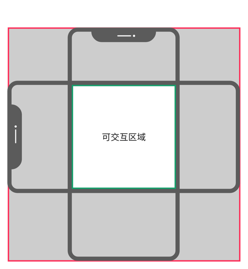
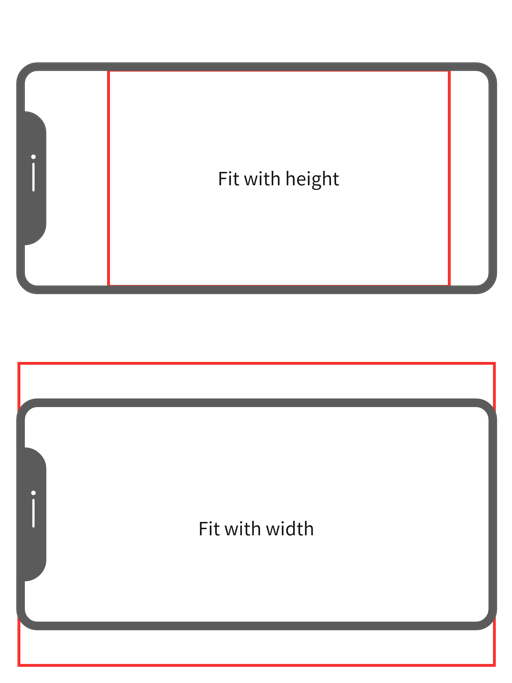

## Playable Template 2D

[](https://github.com/castbox/playable_cocos_template_2d/releases)

### 快速开始

- #### 版本选择

  由于cocos creator 版本不能共用，所以使用不同的分支分别对相应的版本进行支持，目前支持cocos creator 3.8.2、cocos creator 3.7.4。后期根据需要增加对其他cocos creator版本地支持。

- #### 集成说明

  - 在Cocos creator Dashboard中选择合适的版本，一般情况下选择最新的版本（目前最新的为3.8.2），特例是由于spine版本的原因，在有spine动画需求的时候需要选择3.7.4。

  - 选择Empty(2D)模版创建项目。
  
  - 使用git submodule 安装到项目中。
  
    ```sh
    cd ${YourCocosCreatorProject}
    git submodule add -b ${Branch} git@github.com:castbox/playable_cocos_template_2d.git assets/playable_cocos_template_2d
    ```
  
  - 在github建立仓库，并链接到这个github仓库。
  
    ```sh
    git remote add origin git@YourGithubRepo.git
    git fech -all
    git checkout main
    git add .
    git commit -m "Your commit message"
    git push
    ```
  
  - 集成之后首次克隆
  
    ```sh
    git clone git@YourCocosCreatorProject.git
    
    # 此命令为初始化并下载此模版的内容到本地
    git submodule update --init
    ```
  

### 目录结构

- #### rawRes

  这里放置尚未加工的美术资源，比如`animation`、`shader`、`spine`、`template`(事先创建好的`Prefab`，用于创建`Prefab`变体)、`texture`、`material` 等等。

- #### resources

   这里放置动态需要加载的的资源，这些资源会在构建时，包含引用的`rawRes`资源一起进入包体，所以如果包体比较大首先应该考虑，减少或者压缩这个目录下包含资源树。

- #### scene

  这里放置场景文件，所以项目都使用统一的launch场景，lanuch场景具体说明如下：

  ```c
  launch.scene
  ├── playable	// playable驱动
  ├── scene	// 场景管理器
  │   └── canvas
  │       ├── sceneCam	// 场景相机
  │       ├── gamePlay	// 关卡场景需要放置在此之下
  │       ├── vfx	// 特效播放器
  │       └── guide	// 引导管理器
  │           ├── mask	// 引导遮罩
  │           ├── finger	// 引导指引
  │           └── content	// 引导文字说明
  ├── ui															
  │   ├── canvas	// 加载的UI会放置在此之下
  │   │   └── uiCam	// UI相机
  │   └── canvas
  │       └── install	// 位于全局统一的下载按钮
  ├── audio	// 音乐播放器
  │   ├── bgm					
  │   └── sfx
  └── input	// 输入管理器 
  ```
  
  
  
- #### script

  - ##### framework

    这里放置和项目无关的框架代码，用于保证核心逻辑和业务逻辑的解耦。

  - ##### game

    这里放置业务逻辑相关代码，具体说明如下：

    ```c
    .
    ├── guide	// 具体项目的引导逻辑
    ├── internal	// 抽象提炼的玩法，和具体项目解耦
    ├── logic	// 具体项目的关卡逻辑
    └── ui	// 具体项目的UI逻辑
    ```
    
  - ##### test
  
    这里放置单元测试代码，测试完成后方可集成到主分支。

### 命名规范

- **使用小写字母和连字符（-）来分割单词**。例如， `spine-gray-bg.mtl`。这种命名方式有助于保持文件名的简洁性和可读性，同时也与许多现代Web开发的命名习惯保持一致。
- **类名与文件名匹配，并遵循类命名规范**。例如，`PlayableGamePlayCore` 类对应的文件名应为 `playable.gamePlay.core.ts`，`PlayableManagerCore` 类对应的文件名应为 `playable.manager.core.ts`。
- **类中私有字段应该以下划线(_)开始**。例如， `private _sceneOrientation: EScreenOrientation` 。
- **类中公有字段应该首字母大写**。例如， `public String : string`
- **类中所有的方法应该首字母小写**。例如，`private gameOver()`、`protected start()`、`public OnClick()`

### TypeScript 入门

### Cocos Creator入门

- #### 自适应

  - 需要在横屏和竖屏交集范围內放置可交互物体，这样才能保证横竖屏切换时可交互物体不会被摄像机裁剪掉，从而影响游戏进程。

    

  - 按照可视范围大小调整关卡场景的缩放比例。

  - `layout`可以自动让子物体按照横纵方向排列。

    

    - 无论选择以什么方式排列，影响的只是子物体的坐标。
    - 可以根据子物体的大小自动适配`Layout`的大小（`Resize` 选择`CONTAINER`模式），也可以根据`Layout`的大小适配子物体的大小（`Resize` 选择`CHELDREN`模式）， 但需要注意只会影响选择的那个方向。

  - `widget`可以通过设置对齐参数动态改变元素位置和大小。

    

    - 坐标对齐

      ```typescript
      // 启动底部坐标对齐
      widget.isAlignBottom = true;
      
      // 按照绝对值对齐
      widget.isAbsoluteBottom = true;
      // 保持纵坐标在底部往上100pixel的距离
      widget.bottom = 100;
      
      // 按照比例对齐
      widget.isAbsoluteBottom = false;
      // 保持纵坐标在视口底部往上百分之十的距离
      widget.bottom = 0.1;
      ```

    - 拉伸对齐

      ```typescript
      // 启动竖直拉伸对齐
      widget.isAlignBottom = true;
      widget.isAlignTop = true;
      
      // 按照绝对值对齐
      widget.isAbsoluteBottom = true;
      widget.isAbsoluteTop = true;
      // 保持底部边界拉伸至视口底部往上100pixel的位置
      widget.top = 100;		
      // 保持顶部边界拉伸至视口顶部往下100pixel的位置
      widget.down = 100;
      
      // 按照比例拉伸
      widget.isAbsoluteBottom = false;
      widget.isAbsoluteTop = false;
      // 保持底部边界拉伸至视口底部往上百分之十的位置
      widget.top = 0.1
      // 保持顶部边界拉伸至视口顶部往下百分之十的位置
      widget.buttom = 0.1
      ```

      

  - 设置宽高比自适应策略，下面分别是竖屏和横屏的情况。

    

    

- #### 更换编辑器版本

  - 在更换编辑器版本时，需要将项目目录下的~library~和`temp`文件夹删除，再在`Cocos creator Dashboard`中选择相应的版本进入。

- #### `Prefab`的使用

  `Prefab`可以把自定义的功能部件“打包”到一个`Node`节点中保存起来，可以很好的起到模块序列化的作用， 因为`Prefab`会保持克隆体和本体之间的所有属性的双向同步，需要注意几点：

  - 不支持变体。
  - 支持嵌套。
  - 在`Prefab`克隆体上修改过的属性，只要还没有同步到`prefab`本体上（就算手动改成和`prefab`本体的属性一样），那么这个属性为这个`prefab`克隆体独有。
  - `prefab`克隆体和`prefab`本体之间可以断开关联，也可以建立关联。

- #### 配置

  - ##### Project/Project Settings.Project Data		

    | 参数            | 数值                       |
    | --------------- | -------------------------- |
    | `Desgin Width`  | 720(竖屏)/ 1280(横屏)      |
    | `Desgin Herght` | 1280(竖屏)/ 720(横屏)      |
    | `Fit Width`     | `tue`(竖屏)/`false`(横屏)  |
    | `Fit Height`    | `false`(竖屏)/`true`(横屏) |

  - ##### project/Splash Setting

    | 参数   | 数值 |
    | ------ | ---- |
    | `Logo` | None |
    
  - ##### Project/Build

    | 参数        | 数值          |
    | ----------- | ------------- |
    | `Platfrom`  | `Web Desktop` |
    | `Md5 Cache` | `true`        |

### 运行时（Framwork.Runtime）

#### 场景管理器（PlayableManagerScene）

- ##### 关卡逻辑的实现步骤

  - 创建关卡逻辑类并继承`PlayableGamePlayCore`这个基类。
  - 制作场景Prefab并附加上创建的关卡逻辑类。
  - 放置场景Prefab到launch.scene/scene/gamePlay下。

- ##### 关卡生命周期

  目前关卡以`Prefab`的形式承载，即一个关卡为一个`prefab`，每个关卡需要挂上实现`PlayableGamePlayCore`接口的组件，然后拖到`scene/canvas/gamePlay`下， 每一关结束时需要发送`onGameEnd`这个事件。

  | 接口名         | 说明                                                         |
  | :------------- | ------------------------------------------------------------ |
  | `onGameEnter`  | 关卡激活时自动调用，主要做初始化相关操作。                   |
  | `onGameStart`  | 关卡开始时手动调用。                                         |
  | `onUpdate`     | 关卡迭代更新，每一帧会自动调用。                             |
  | `onGameFinish` | 关卡结束时手动调用，可以进入直接进入下一关或者打开结算界面。 |
  | `onGameEnd`    | 关卡销毁时手动调用。                                         |
  | `onGameOver`   | 如果没有下一关了，会自动调用这个接口，方便做`Playable`结束后的操作，比如打开下载页面。 |
  | `onDestroy`    | 在关闭`Playable`时调用，用于清理资源。                       |

#### 事件管理器（PlayableManagerEvent）

- ##### 订阅/取消订阅

  ```typescript
  private onWatch()
  {
    // TODO
  }
  private _onWatchBind = this.onWatch.bind(this);
  // 订阅一个事件
  PlayableManagerEvent.getInstance().on('事件名', _onWatchBind);
  // 取消订阅一个事件
  PlayableManagerEvent.getInstance().off('事件名', _onWatchBind);
  ```

- ##### 订阅后响应一次自动取消

  ```typescript
  // 订阅一个事件，但是只触发一次
  PlayableManagerEvent.getInstance().once('事件名', ()=>{
      // TODO
  });
  ```

- ##### 同时订阅一组事件，只要其中有一个事件响应一次，自动取消这一组

  ```typescript
  PlayableManagerEvent.getInstance().any((eventName : string)=>{
    Console.log(eventName)
    // TODO
  } '事件名1', '事件名2', ...)
  ```

- ##### 发布

  ```typescript
  // 发布一个事件
  PlayableManagerEvent.getInstance().emit('事件名', ${参数列表});
  ```

  

- ##### 已支持的内置事件类型

| 事件名                 | 触发条件         | 参数                      |
| :--------------------- | ---------------- | ------------------------- |
| `onOrientationChanged` | 屏幕旋转         | 枚举 `EScreenOrientation` |
| `onCanvasResize`       | 视口大小改变     | 无                        |
| `onSceneClick`         | 点击场景任何地方 | 点击的节点 `Node`         |
| `onGameStart`          | 关卡开始         | 无                        |
| `onGameFinish`         | 关卡结束         | 无                        |
| `onGameEnd`            | 关卡销毁         | 无                        |
| `onJumpToStore`        | 跳转到商店页面   | 无                        |

#### UI管理器（PlayableManagerUI）

#### 特效管理器（PlayableManagerVFX）

> [!IMPORTANT]
>
> 特效资源需要放置在resources/vfx 目录下

```typescript
// 播放一个全局特效
PlayableManagerVFX.getInstance().playEffectAtWsPosition("特效名", ${世界坐标 : vec3});

// 播放一个局部特效
PlayableManagerVFX.getInstance().playParticleByTarget("特效名", ${目标 : Node});
```

#### 音频管理器（PlayableManagerAudio）

> [!IMPORTANT]
>
> 音频资源需要放置在`resources/audio`目录下。

- ##### 播放音乐

  ```typescript
  // 播放背景音乐
  PlayableManagerAudio.getInstance().playBGM("背景音乐名");
  ```

- ##### 播放音效

  ```typescript
  // 播放音效
  PlayableManagerAudio.getInstance().playSFX("音效名");
  ```

#### 资源管理器（PlayableManagerResource）

#### 输入管理器（PlayableManagerInput）

监听全局输入事件，特别是`TOUCH`事件。

```typescript
// 获取当前点击的世界坐标
const LastTouchPos: Vec3 = PlayableManagerInput.getInstance().LastTouchPos;
```

#### 引导管理器（PlayableManagerGuide）

#### 配置管理器（PlayableManagerConfig）

所有的配置项都在`asset/resources/config/settings.json`中配置

```json
{
  "Google_Store_URL" : "https://play.google.com/store/apps/details?id=hidden.objects.find.it.out.seek.puzzle.games.free",
  
  "Apple_Store_URL" : "https://apps.apple.com/us/app/id6446246671"
}
```

```typescript
// 获取配置
const settings: JsonAsset = PlayableManagerConfig.getInstance().settings;
// 读取配置
settings.json[${配置项 : string}]
```

### 基础玩法（Game.Internal）

- #### Find Out

- #### Find It

- #### 纸牌（Poker） 

- #### Ball Sort
